<picture>
  <source media="(prefers-color-scheme: dark)" srcset="dark.svg">
  <source media="(prefers-color-scheme: light)" srcset="light.svg">
  
</picture>

<h3 align="center">✨ Creating Digital Experiences that Matter</h3>

Blending human-centered design with cutting-edge AI, I craft digital solutions that bridge the gap between users and innovation — from Explainable AI research to interfaces people can actually trust.

 

### 🎯 Who I am

Research Fellow at the **University of Siena**, working on **Explainable AI (XAI)**, LLM engineering/fine-tuning and RAG systems across cybersecurity, healthcare and industrial edge computing. Two degrees with highest honors in Communication Strategies & Experience Design gave me a UX-research lens that I now bring to AI systems — my focus is making them understandable, verifiable and meaningful for the people who use them, not just accurate on paper.

### 🚀 What I'm passionate about

- 🧠 Explainable AI & LLM Engineering
- 🎨 Human-Centered Design & UX Research
- ♿ Digital Accessibility & Inclusion
- 🔒 Privacy-by-Design & Edge AI
- 💡 Emerging Technologies

### 🎮 Beyond research

- 🎮 Gaming on my Nintendo Switch 2 and PC
- 🎵 Making music with my flute and guitar
- 🌟 Exploring where AI, design and everyday life intersect

 

*Let's create meaningful, trustworthy AI experiences together!* 🌟

